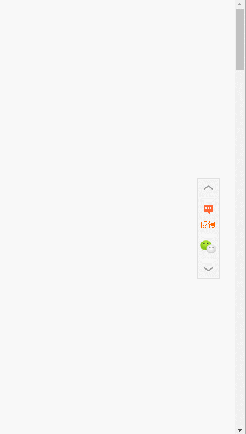

# jQuery带微信的返回顶部/底部代码scrollTop2
效果如下：



all code:
```
<!doctype html>
<html lang="en">
<head>
    <meta charset="UTF-8">
    <title>jQuery带微信的返回顶部/底部代码</title>
    <link href="css/style.css" rel="stylesheet" type="text/css" />
</head>
<body>
<div style="text-align:center;margin:5000px 0">
    <!--浮动面板-->
    <div id="floatPanel">
        <div class="ctrolPanel">
            <a class="arrow" href="#"><span>顶部</span></a>
            <a class="contact" href="www.baidu.com" target="_blank"><span>反馈</span></a>
            <a class="qrcode" href="#"><span>微信二维码</span></a>
            <a class="arrow" href="#"><span>底部</span></a>
        </div>
        <div class="popPanel">
            <div class="popPanel-inner">
                <div class="qrcodePanel">
                    
                    <span>扫描二维码关注我为好友</span>
                </div>
                <div class="arrowPanel">
                    <div class="arrow01">
                    </div>
                    <div class="arrow02">
                    </div>
                </div>
            </div>
        </div>
    </div>
</div>
</body>
</html>
<script src="js/jquery-1.7.2.min.js"></script>
<script>
    $(function(){
        // 页面浮动面板
        $("#floatPanel > .ctrolPanel > a.arrow").eq(0).click(function(){$("html,body").animate({scrollTop :0}, 800);return false;});
        $("#floatPanel > .ctrolPanel > a.arrow").eq(1).click(function(){$("html,body").animate({scrollTop : $(document).height()}, 800);return false;});
        var objPopPanel = $("#floatPanel > .popPanel");
        var w = objPopPanel.outerWidth();
        $("#floatPanel > .ctrolPanel > a.qrcode").bind({
            mouseover : function(){
                objPopPanel.css("width","0px").show();
                objPopPanel.animate({"width" : w + "px"},300);return false;
            },
            mouseout : function(){
                objPopPanel.animate({"width" : "0px"},300);return false;
                objPopPanel.css("width",w + "px");
            }
        });
    });
</script>
```

